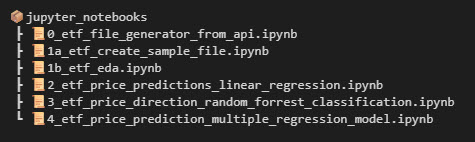
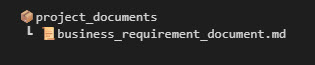
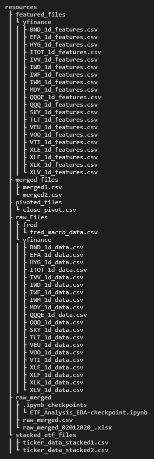
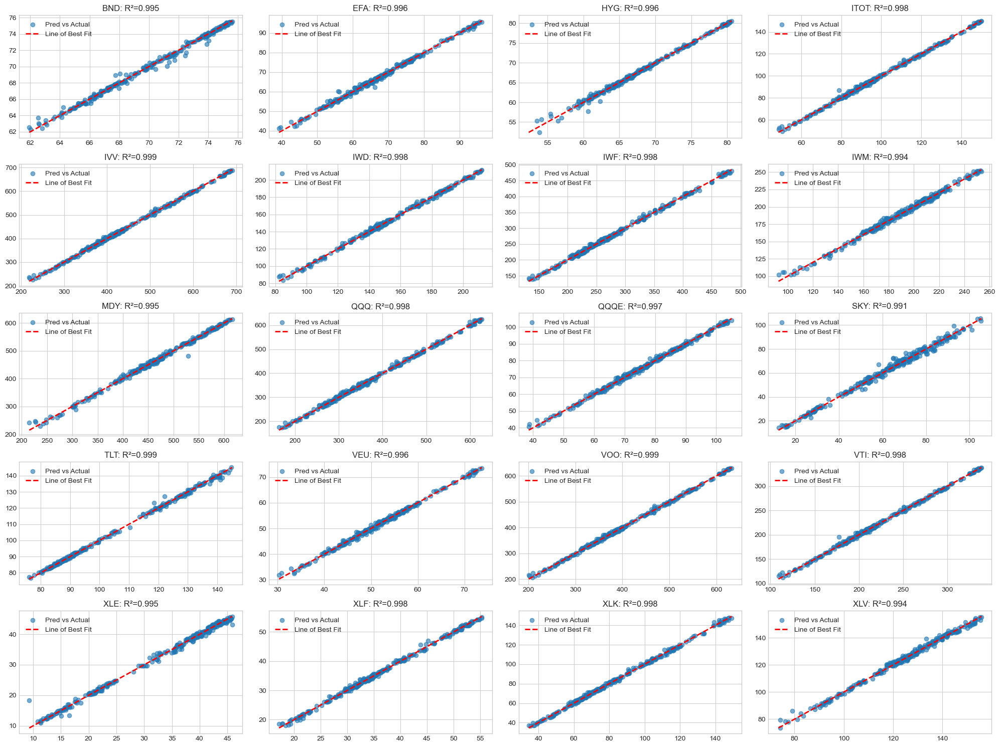
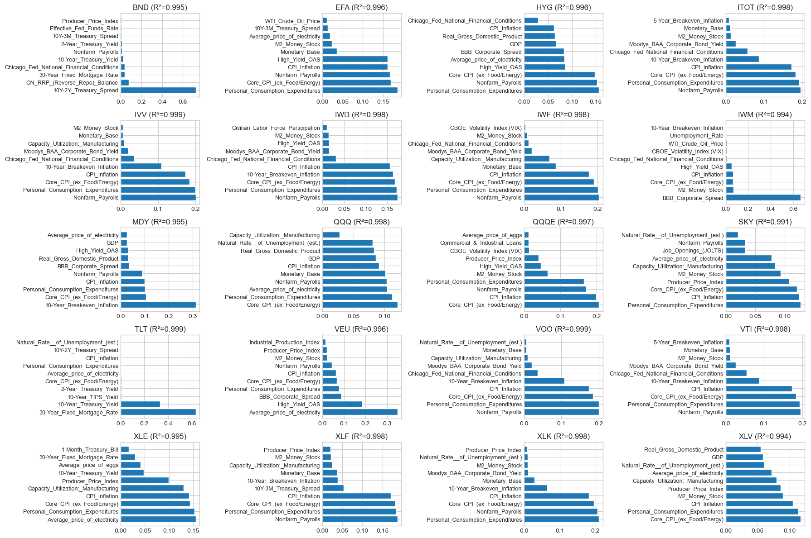
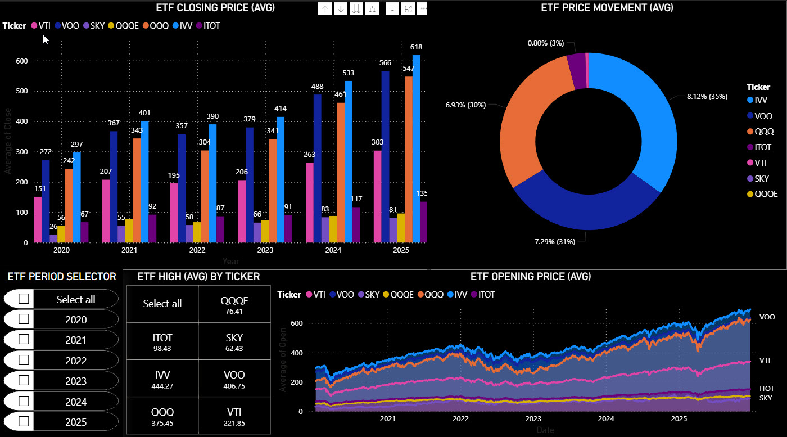
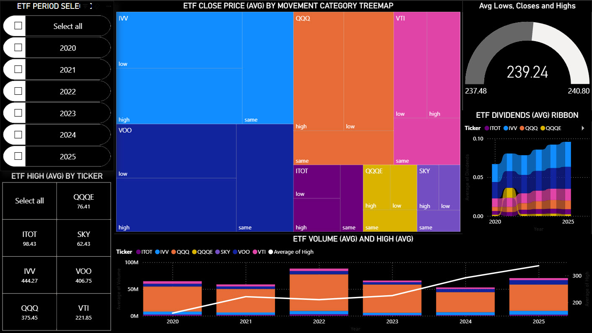
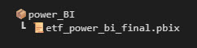

ETF Prediction ML Models: A Brief Background
============================================

Research shows most financial institutions will spend a hefty share of their financial budget and resources building ML models to *anticipate* and *predict* ETF price direction accuracy (whether the price will go up or down on a given timeframe, say hourly or daily). They do this to generate ETF buy/sell signals, by feeding their ML models with premium (read costly) real-time financial market data. Although the overall process is proving a relatively expensive endeavour for the financial sector, at the time I'm writing this, they are only getting accuracy rates of around 50-57% (this is little better than flipping a coin). Research also shows that ML models to predict ETF price still are sadly not considered as normal practice (again at the time of writing).

Business Opportunity/Challenge & Context
========================================

What if there was a way to accurately predict **BOTH** *ETF price direction* **AND** *ETF closing price* using just generic, easily accessible & freely available macroeconomic indicator (time series) data (e.g. US Gross Domestic Product (GDP) figures generated daily)?

**For context - business use case scenario example:** the proposed ML ETF **close price** prediction model from this project could provide reliable insight to investors in real-time (by using a live ETF data feed) that through valuation, if the ETF(s) in his/her portfolio is *under or over-priced*. If say an ETF is expected to be *under-priced*, this could possibly trigger a 'buy order' in the anticipation that the closing price of the ETF would more than likely go up as the ETF market corrects itself. The reverse would be true for *over-priced* ETFs -- a 'sell order' could be anticipated in advance. In both cases the investor could make a decent profit if he acted accordingly, using  the model predictive prowess to guide him/her.

**Similarly**, accurately predicting ETF **price direction** could EVENTUALLY provide an investor with market movement anticipation (say if the ETF market is 'bullish' or 'bearish'), optimise his/her trading strategies and help with effective market/investment risk management.

This model, SHOULD creates business value and without a live feed could still be used for back-testing ETF trade data.

Business Requirement, Scope & Hypotheses
========================================

Requirement One-Line Summary:
-----------------------------

*"Can Machine Learning models utilise generic, publicly available macroeconomic indicator data to accurately predict ETF (daily) closing price & (daily) price direction?"*

Additional Business Requirement
-------------------------------

*Find a way to accurately predict closing price for up to 20 ETFs at the same time (running multiple predictive models).*

Business Variable Scope
-----------------------

| **ETF:** | US-Based ETFs only |
| --- |  --- |
| **Macro-Economic Data:** | US-Based Indicators Only |
| **Time Series Date Range:** | 01/01/2020 to 31/12/2025 |
| **Time Series Data Interval:** | 1 day (1d) |

### Business Subject: ETF Scope (Total of 20):

| **Grouping Description** | **Ticker Name** |
| --- |  --- |
| Core S&P/Total Market | 'SKY', 'VOO', 'IVV', 'VTI', 'ITOT' |
| Nasdaq/Growth | 'QQQ', 'QQQE' |
| Small/Mid/Growth/Value | 'IWM', 'IWF', 'IWD', 'MDY' |
| Tech/Finance/Energy | 'XLK', 'XLF', 'XLE', 'XLV' |
| Bonds | 'TLT', 'BND', 'HYG' |
| International (US-listed) | 'VEU', 'EFA' |

Hypotheses (what I intend to prove):
------------------------------------
| **No.** | **Hypothesis Description** |
| --- |  --- |
| **H0:** | Machine Learning ETF (**H2** and **H3**) predictions accuracy relies heavily on macroeconomic data |
| **H1:** | Most ETF close prices and price direction are heavily influenced by GDP data figures |
| **H2:** | Most ETF close prices are accurately predicted using *just* macroeconomic data |
| **H3:** | Most ETF price directions are accurately predicted, again using just macroeconomic data |

 Hypotheses Validation Methods (what I will use to prove the above):
--------------------------------------------------------------------

| **No.** | **Validation Method Description** |
| --- |  --- |
| **V0:** | Parallel testing datasets with and without macroeconomic data using Classical Machine Learning |
| **V1:** | Classical Machine Learning -- Feature Selection |
| **V2:** | Classical Machine Learning -- Linear Regression |
| **V3:** | Feature Engineering - Machine Learning -- Classification by Random Forrest |

Dataset Source(s): Considered
=============================

Static Dataset Source (used initially for research, but dropped in favour of more dynamic APIs below)

| **Name of Dataset** | Huge Stock Market Dataset |
| --- |  --- |
| **Data Description** | Historical daily prices and volumes of all U.S. stocks and ETF                 |
| **Data Source Origins** | [Kaggle](https://www.kaggle.com/) |
| **Web URL** | <https://www.kaggle.com/datasets/borismarjanovic/price-volume-data-for-all-us-stocks-etfs> |
| **Dataset Original Filenames** | Archive.zip (containing various stock and ETF data files) |
| **Dataset version and file size** | 516MB |
| **Useability Rating** | 7.50/10.00 |
| **Dataset Dated** | 16/01/2026 (Download Date) |

Dataset Source(s): Used
=======================

Dynamic API Dataset Source (two data sources were used **FRED** for macroeconomic indicators and **Yahoo Finance** for ETF)

| FRED (or Federal Reserve Economic Data) -- Federal Reserve Bank of St. Louis | <https://fred.stlouisfed.org/> |
| --- |  --- |
| Yahoo Finance | <https://finance.yahoo.com/markets/etfs/most-active/> |

Project Plan/Board
-----------------------------------------------

| **Documentation** | **Link** |
| --- |  --- |
| Project Plan/Board | https://trello.com/b/bhCNa53F/capstone-project-tish-srisasi-etf-close-price |

Git-Hub Directory Structure
---------------------------

	
Project Results (Highlights)
-----------------------

Project Delivery Challenges & Bug Fixes
---------------------------------------

### Data Sourcing

- **Challenge** -- learning how to import data from APIs into data frames & coding the functions to simultaneously pull datasets from BOTH APIs at the same time.

### Machine Learning Models

- **Potential BUG** -- but more like user error that needs further investigation -- some data rows were missing when linking two datasets using Pandas merge feature (inside join) -- however there were only a few rows difference, so did not impede testing and wasn't significant enough to affect the outcome.

- **Challenge** -- devising a way to match two datasets on dates using two separate/unmerged datasets when the ML model requires them both to have specific and unique dates. Overcame this by using the equivalent of a Microsoft Excel 'VLOOKUP'. Please refer to Notebook No. 4 for more details.

### Dashboards

- **Potential BUG &** **User Oversight** -- on Tableau -- as the dashboards were build earlier on, due to a typo, I was pulling down ETF Tickers called 'SPY' however it should have been 'SKY'. Due to the version of Tableau we were given, I got an error when trying to change the data source. So, I've left the Tableau data set as is and provided the data files used to create the dashboard for review purposes. Fortunately, SPY is also a US-Based ETF and has similar characteristics to 'SKY' (probably more by luck than design -- but it appears to have worked out well).

Data Visualisation Rationale
----------------------------

### Power BI (Desktop and Cloud versions)

- **All charts are created from the {Yahoo Finance:ETF} dataset**

### Tableau Public (Desktop and Cloud versions)

- All charts are created from the \[FRED Macroeconomic Indicators\] & {Yahoo Finance:ETF} datasets

- Here we mix and match \[FRED Macroeconomic Indicators\] data and {Yahoo Finance: ETF} datasets according to Feature Importance results

- Overall Dashboard: \[Key Macroeconomic Indicators\] vs {ETF Close Price -- 6 chosen ETFs}

  - All chart calculations are based on % value change from first date -- this is across both ETF and macroeconomic charts for sake of comprehensive like-to-like comparisons between 2 datasets.

  - This shows the top 10 Feature Importance charts versus

  - ETF Close Price (for chosen ETF tickers in the application's filter)

- Heatmap Wall: {ETF} & \[Macroeconomic\] Data

  - Not based on Model results (just shows differences across same timeline)

  - Can be made Hot-Swappable depending on demand

- ETF Health Check (created for Individual ETF Tickers e.g. QQQ)

  - All chart calculations are based on % value change from first date -- this is across both ETF and macroeconomic charts for sake of comprehensive like-to-like comparisons between 2 datasets.

  - Made from the top 6 Feature Importance for a particular ETF versus

  - ETF's Average Closing Price (Line) and Average Volume (Bar)

  - Hot-Swappable option is available

  - Can be made for each ETF that's in a particular investment portfolio (3 sample Watcher Tickers provided)

  - All chart calculations are based on % value change from first date -- this is across both ETF and macroeconomic charts for sake of accurate comparisons

Dashboards: Design & Deployment
-------------------------------

Power BI (Desktop and Cloud Versions)
-------------------------------------
- **Target Audience: ETF Investors & ETF Traders/Trading Desks**

- **All charts are created from the \[FRED Macroeconomic Indicators\] & {Yahoo Finance:ETF} dataset**

## Power BI - Board 1

- {Period Selector} (By Year, Quarter, Month and Day)(List Slicer)

- {ETF selector} (which also shows the highest average value)(Button Slicer) -- Choice of 6 Tickers in the demo version (but can be expanded to all 20)

- {ETF Average Closing Price} (Bar Charts) -- X Axis Date; Y Axis Average Closing Price

- {ETF Average Price Movement} (Donut Chart)

- {ETF Average Open Price} (Area Chart)

## Power BI - Board 2

- {Period Selector} (By Year, Quarter, Month and Day)(List Slicer)

- {ETF selector} (which also shows the highest average value)(Button Slicer) -- Choice of 6 Tickers

- {ETF Average Close Price by Price Movement Category} (Treemap Chart)

- {ETF Average Lows, Close and Highs} (Gauge Chart)

- {ETF Average Dividends} (Ribbon Chart)

- {ETF Average Volume} (Line and Stacked Column Chart)

Tableau Public (Desktop and Cloud versions)
-------------------------------------------

-          **Target Audience: ETF Watchers & Economic or Financial Business Analysts**

-          **All charts are created from the \[FRED Macroeconomic Indicator data\] & {Yahoo Finance:ETF} dataset**

## Tableau - Heatmap Wall {ETF} & [Macroeconomic] Data

(all Heatmap Charts, with hot-swappable interface)

- {Average ETF Closing Price}

- {Average ETF Trading Volume}

- \[Average Price of Electricity\]

- \[Average Non-Farm Payroll\]

- \[Average Price of Eggs\]

- \[Average GDP\]

## Tableau - Health Check - ETF Watcher's Screen (created for Individual ETF Tickers e.g. QQQ)

- {QQQ Close Price & Trade Volume} (Line and Column Charts combo)

- \[Natural Rate of Unemployment\] (Line Chart)

- \[Non-Farm Payrolls\] (Line Chart)

- \[Monetary Base\] (Line Chart)

- \[Core CPI and CPI Inflation\] (Line Charts)

- \[Personal Consumption Expenditure\] (Line Chart)

## Tableau - Overall Dashboard : [Key Macroeconomic Indicators] vs {ETF Close Price – 6 chosen ETFs} 

(all Line Charts, with hot-swappable interface)

- {ETF Close Price Summary}

- \[Produce Price Index\]

- \[Core CPI and CPI Inflation\]

- \[10Y-2Y Treasury Spread\]

- \[Average Price of Electricity\]

- \[Natural Rate of Unemployment\]

- \[GDP\]

- \[Personal Consumption Expenditure\]

- \[Capacity Utilization: Manufacturing\]

- \[M2 Money Stock\]

| **Application** | **Link** |
| --- |  --- |
| Tableau: |  |
| \-          Overall | [https://public.tableau.com/app/profile/teerachai.srisasi/viz/Tableau\_ETF\_Final/OVerall](https://public.tableau.com/app/profile/teerachai.srisasi/viz/Tableau_ETF_Final/OVerall) |
| \-          Heatmap Wall | [https://public.tableau.com/app/profile/teerachai.srisasi/viz/Tableau\_ETF\_Final/Heatmaps](https://public.tableau.com/app/profile/teerachai.srisasi/viz/Tableau_ETF_Final/Heatmaps) |
| \-          ETF Health Check: |  |
| \-          QQQ | [https://public.tableau.com/app/profile/teerachai.srisasi/viz/Tableau\_ETF\_Final/QQQ](https://public.tableau.com/app/profile/teerachai.srisasi/viz/Tableau_ETF_Final/QQQ) |
| \-          QQQE | [https://public.tableau.com/app/profile/teerachai.srisasi/viz/Tableau\_ETF\_Final/QQQE](https://public.tableau.com/app/profile/teerachai.srisasi/viz/Tableau_ETF_Final/QQQE) |
| \-          VOO | [https://public.tableau.com/app/profile/teerachai.srisasi/viz/Tableau\_ETF\_Final/VOO](https://public.tableau.com/app/profile/teerachai.srisasi/viz/Tableau_ETF_Final/VOO) |
| Power BI: (No Cloud Service -- Local File Only) |  |

Main Data Analysis Libraries
--------------------------------------
| **Python Library Name** | **Usage** |
| --- |  --- |
| [pandas](https://pandas.pydata.org/) | Loading and manipulating data frames (Used in All Notebooks) |
| [numpy](https://numpy.org/) | Data Analysis & Numerical Calculations (Used in All Notebooks) |
| [matplotlib.pyplot](https://matplotlib.org/3.5.3/api/_as_gen/matplotlib.pyplot.html) | Data Visualisation -- Data Plots, Bar Charts, Histograms (Used in Notebooks 2 to 4) |
| [seaborn](https://seaborn.pydata.org/) | Data Visualisation -- Statistical Data Analysis Charts (Used in Notebooks 2 to 4) |
| [warnings](https://docs.python.org/3/library/warnings.html) | Ignore system warnings (Used in All Notebooks) |
| [os](https://docs.python.org/3/library/os.html) | Check current directory(Used in All Notebooks) |
| [sklearn.model\_selection](https://scikit-learn.org/stable/api/sklearn.model_selection.html)  | ETF Price Predictions using Linear Regression (Notebooks 2 + 4) |
[sklearn.linear\_model](https://scikit-learn.org/stable/api/sklearn.linear_model.html)  
[sklearn.metrics](https://scikit-learn.org/stable/api/sklearn.metrics.html)  
[sklearn.preprocessing](https://scikit-learn.org/stable/api/sklearn.preprocessing.html) 
| [sklearn.ensemble](https://scikit-learn.org/stable/api/sklearn.ensemble.html)  | ETF Price Direction using Random Forrest Classification (Notebook 3) |
[sklearn.metrics](https://scikit-learn.org/stable/api/sklearn.metrics.html) 

Business Applications
---------------------
These models have strong business pontential in the finance sector (however for the purposes of this capstone project, it should be used for educational purposes only)

- Trading Strategies
- Portfolio Management
- Risk & Analytics
- Institutional Applications

### Next Steps
--------------
1. Feed the Yahoo Finance: ETF and FRED: macroeconomic indicator data directly into Power BI and Tableau
2. Use the predictive models to create an app in Streamlit -- then deploy
3. Test other types of ML models and see which one gives better predictive accuracy
4. Expand to Global ETF & Macroeconomic datasets using available and relevant APIs.
5. Further use of ML Cross-Validation models for transparency.
6. Finally build a live direct API feed into the ML model and test to see if this can be used to accurately predict ETF direction and current price.

Ethical Considerations/GDPR
---------------------------

| **Subject Matter** | Supporting Statement |
| --- |  --- |
| **Disclaimer** | As per the **section** below, I must emphasise that this project is educational only and utilises only public and freely available FRED economic data. The model has limitations and should NOT be used commercially. |
| **Ethical Consideration** | Models' limitations: Please note that past performance of economic indicators does not predict FUTURE ETF close prices due to the uncertainty of market volatility, BLACK SWAN events and potential overfitting risks. |
| **BIAS and fairness concerns** | As mentioned earlier, the FRED economic data's limited scope covers just US-based ETFs. Therefore, it should NOT be used on a global scale (country bias), e.g. predicting Global ETF close prices. |
| **Legal note** | FRED data is public domain from the St. Louis Fed -- and is free for non-commercial use only -- there is no direct/indirect endorsement here from me and you are free to select other sources as a basis for running your models on. |
| **UK Regulatory compliance** | Any *performance claims* within this project are merely speculative and should not be considered as financial advice. |
| **GDPR notes** | FRED and Yahoo Finance data contains no personal data, so GDPR is not applicable -- this capstone is compliant by default. |

Disclaimer (UK)
---------------

*This repository and the machine learning model it contains are provided **for educational and research purposes only** and **do not constitute investment or financial advice or a personal recommendation** under UK law. Users should not rely on any content or outputs as a basis for making investment decisions and should seek advice from an independent, authorised financial adviser.*

*The author is **not authorised or regulated by the Financial Conduct Authority (FCA)**, and nothing herein is a financial promotion. Use of the code, models and information is entirely at your own risk, and the author accepts **no liability** for any loss or damage arising from their use or reliance.*

Credits
-------

- [**Perplexity AI**](https://perplexity.ai)-- for the Banner Image and Disclaimer (UK) above, as well as helping me with coding API data extraction (Notebook 0), feature enhancement (seasonality), complex loops and (my idea) to run multiple models (as realised in Notebook 4).

- [**Code Institute: Data Analytics with AI Bootcamp Course Notes**](https://codeinstitute.net/data-analytics-and-ai-bootcamp/) -- The Masterclass Notebooks (by John Anilh) were particularly inspirational for Python code, ML concepts, and data visualization ideas.

- [**Udemy**](https://www.udemy.com/course/tableau-for-beginners-free/learn/lecture/32946634?start=150) -- A free course on Tableau called "Introduction to Tableau Data Visualization for Beginners -- by Jed Guinto"  

- [**md2word.com**](https://www.md2word.com/en) for the most help with converting my Word documents to Markdown.

Acknowledgements
----------------

- Thank you, Gordon Fuller, for giving me my first city job as a Data Business Analyst.

- This work is dedicated to my sister, Netch, whose cooking skills kept her brother well nourished throughout this course. I couldn't have done all this without your help!

Footnote (as a reminder to myself)
--------

For my capstone project, I wanted to do something a bit **different**:

-         I wanted to move away from the limitations of *Kaggle* and try to make my own dynamic dataset using *APIs*.

-         I wanted to continue with the *storytelling* from my [Individual Formulative Assignment](https://github.com/tishsrisasi/Individual_Formative_Assignment) (link provided).

-         I wanted to mimic predictive Machine Learning models like those currently used in real-world situations.        

**Teerachai ('Tish') Srisasi**  
(19th January 2026)